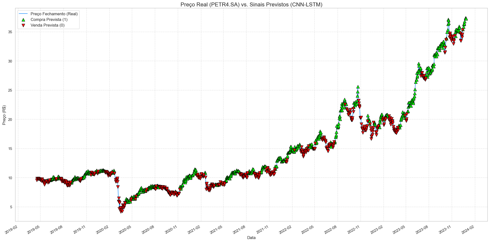
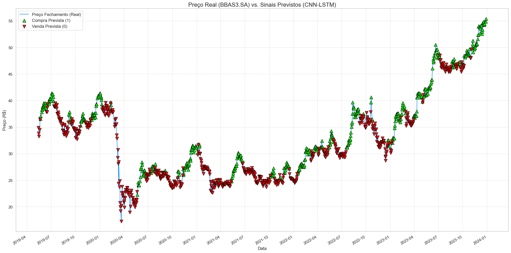
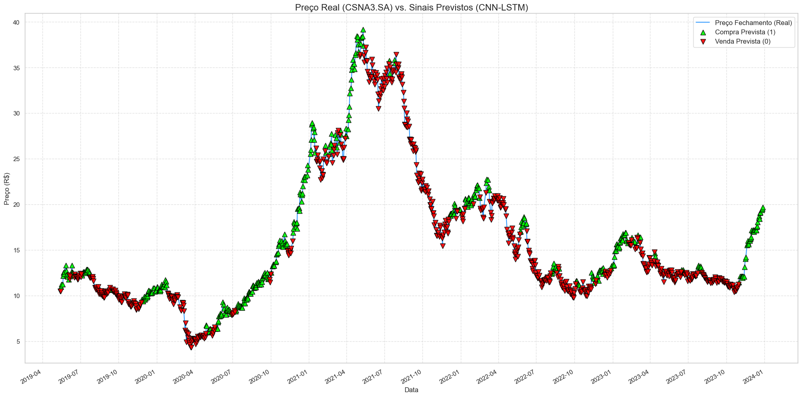
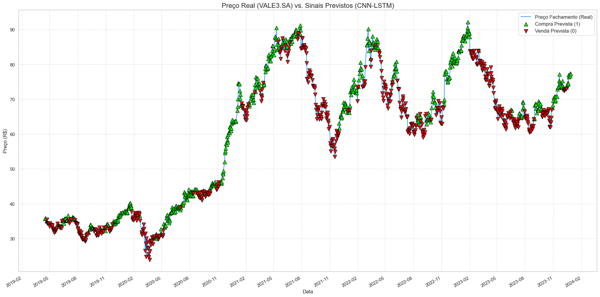
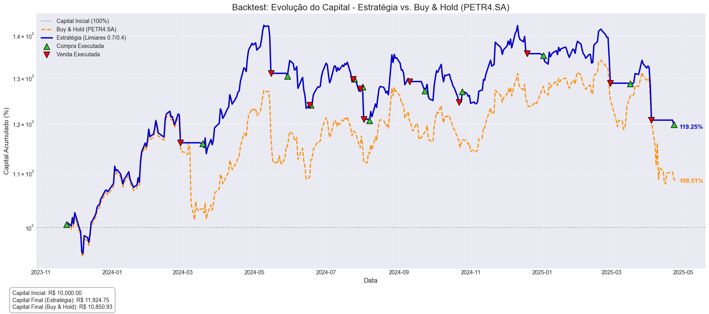
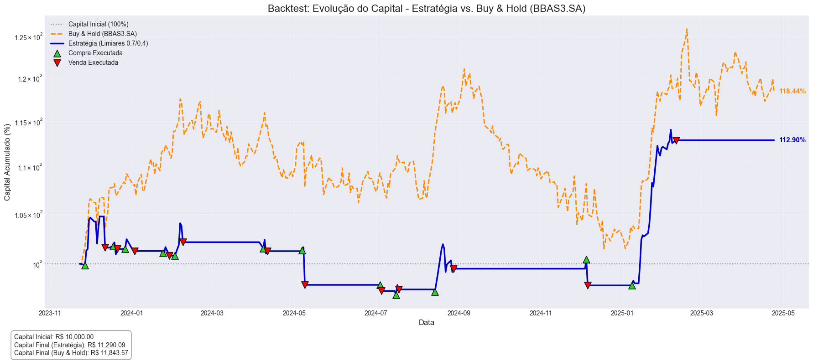
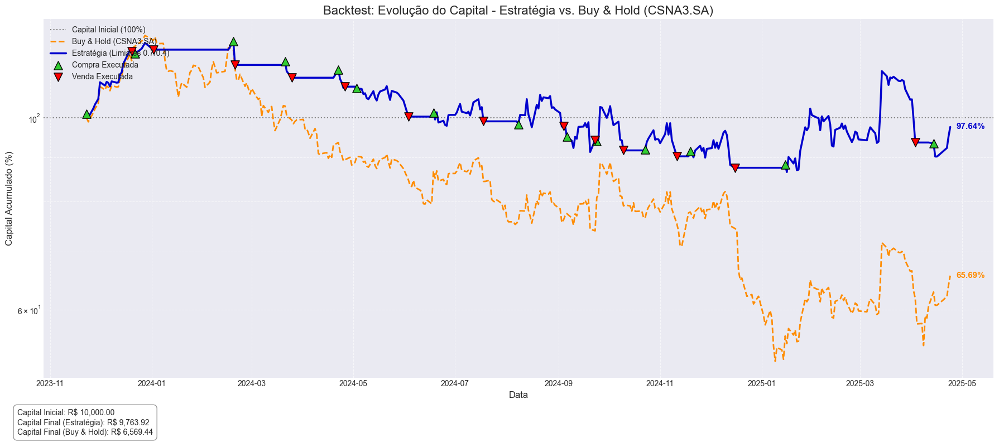
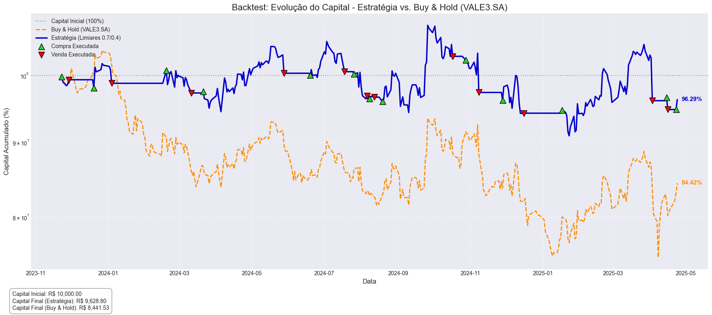

# Análise de Tendências de Ações com Deep Learning

## Introdução

Este projeto implementa modelos de Deep Learning para análise e previsão de tendências em ações do mercado financeiro brasileiro. O objetivo principal é desenvolver um sistema capaz de identificar tendências de alta ou baixa para 4 ações específicas (VALE3, PETR4, BBAS3 e CSNA3), baseando-se no comportamento dos preços nos últimos 15 dias.

A proposta é criar um modelo "perseguidor de tendência", ou seja, que recomende a compra quando a tendência é de alta e a venda quando a tendência é de baixa. O sistema utiliza dados históricos rotulados por economistas, que realizaram uma suavização dos preços de fechamento e classificaram cada dia como uma oportunidade de compra (+1) ou venda (-1).

## Pré-requisitos

### Deep Learning

- TensorFlow 2.15.0
- TensorFlow-macos 2.13.0
- TensorFlow-metal 1.0.0
- Keras 2.13.1
- Keras-tuner 1.4.7

### Manipulação e Análise de Dados

- Python 3.13.2
- Pandas 2.1.3
- NumPy 1.26.4
- SciPy 1.12.0
- Statsmodels 0.14.0

### Visualização

- Matplotlib 3.8.2
- Seaborn 0.13.2
- Plotly 5.18.0

### Machine Learning

- Scikit-learn 1.3.2

### Análise Técnica

- TA-Lib 0.4.19
- TA 0.11.0

### Processamento de Imagens

- Pillow 10.1.0

### Ambiente de Desenvolvimento

- Jupyter 1.0.0
- JupyterLab 4.4.0

## Estrutura do Projeto

```
├── data/                  # Dados históricos das ações
│   ├── VALE3.SA/          # Dados da Vale
│   ├── PETR4.SA/          # Dados da Petrobras
│   ├── BBAS3.SA/          # Dados do Banco do Brasil
│   └── CSNA3.SA/          # Dados da CSN
├── images/                # Visualizações e gráficos gerados
│   ├── backtesting/       # Gráficos de resultados do backtesting
│   └── price_vs_predicted_signals/ # Gráficos de preços vs sinais previstos
├── models/                # Modelos treinados salvos
│   ├── BBAS3_SA_cnn_lstm_model.keras   # Modelo CNN-LSTM para BBAS3
│   ├── CSNA3_SA_cnn_lstm_model.keras   # Modelo CNN-LSTM para CSNA3
│   ├── PETR4_SA_cnn_lstm_model.keras   # Modelo CNN-LSTM para PETR4
│   └── VALE3_SA_cnn_lstm_model.keras   # Modelo CNN-LSTM para VALE3
├── notebooks/             # Jupyter notebooks
│   ├── *_eda_notebook.ipynb            # Análise exploratória dos dados
│   ├── *_cnn_lstm_notebook.ipynb       # Implementação de modelos CNN-LSTM
│   ├── vale3_lstm_notebook.ipynb       # Modelo LSTM para Vale
│   ├── vale3_cnn1d_notebook.ipynb      # Modelo CNN 1D para Vale
│   ├── vale3_cnn2d_notebook.ipynb      # Modelo CNN 2D para Vale
│   └── backtest_presentation_notebook.ipynb # Backtesting dos modelos
├── hiper_tuning/          # Scripts para otimização de hiperparâmetros
│   ├── lstm_hyper_tuning.py            # Otimização para modelos LSTM
│   ├── cnn1d_hyper_tuning.py           # Otimização para modelos CNN 1D
│   └── cnn2d_hyper_tuning.py           # Otimização para modelos CNN 2D
├── requirements.txt       # Dependências do projeto
└── README.md              # Este arquivo
```

## Configuração do Ambiente

1. Clone o repositório:

```bash
git clone <url-do-repositorio>
cd ml-task-stock
```

2. Crie um ambiente virtual e ative-o:

```bash
conda create -n task-stock python=3.10
conda activate task-stock
```

3. Instale as dependências:

```bash
pip install -r requirements.txt
```

## Resumo de Desempenho dos Modelos

Nesta seção, apresentamos um breve panorama dos principais resultados alcançados e a performance de cada modelo testado. Os gráficos abaixo, disponíveis em `images/price_vs_predicted_signals/`, ilustram a aderência entre os sinais previstos e o comportamento real dos preços para cada ação.

**PETR4.SA:**  

**PETR4.SA - Preço Real vs. Sinais Previstos.** Gráfico comparando a evolução do preço de fechamento real de PETR4.SA (linha verde) com os sinais de Compra (▲) e Venda (▼) gerados pelo modelo CNN-LSTM para o dia seguinte, no período de Fev/2019 a Jan/2024.

**BBAS3.SA:**  

**BBAS3.SA - Preço Real vs. Sinais Previstos.** Gráfico comparando a evolução do preço de fechamento real de BBAS3.SA (linha verde) com os sinais de Compra (▲) e Venda (▼) gerados pelo modelo CNN-LSTM para o dia seguinte, no período de Abr/2019 a Jan/2024.

**CSNA3.SA:**  

**CSNA3.SA - Preço Real vs. Sinais Previstos.** Gráfico comparando a evolução do preço de fechamento real de CSNA3.SA (linha verde) com os sinais de Compra (▲) e Venda (▼) gerados pelo modelo CNN-LSTM para o dia seguinte, no período de Abr/2019 a Jan/2024.

**VALE3.SA:**  

**VALE3.SA - Preço Real vs. Sinais Previstos.** Gráfico comparando a evolução do preço de fechamento real de VALE3.SA (linha verde) com os sinais de Compra (▲) e Venda (▼) gerados pelo modelo CNN-LSTM para o dia seguinte, no período de Fev/2019 a Jan/2024.

---

# Backtesting de Estratégia de Trading com Modelo CNN-LSTM

## Metodologia: Backtesting

O backtesting é uma técnica essencial para avaliar a viabilidade de uma estratégia de trading, aplicando-a a dados históricos de mercado. Ele permite simular como a estratégia teria performado no passado, fornecendo insights sobre sua potencial lucratividade e risco antes de aplicá-la em tempo real.

## O Modelo: CNN-LSTM

Utilizamos um modelo híbrido CNN-LSTM que foi treinado separadamente para cada ação. A arquitetura combina:

- **CNN:** Para extrair features espaciais e padrões locais das sequências de indicadores técnicos.
- **LSTM:** Para capturar dependências temporais e sequenciais nos dados.

O modelo foi treinado para prever a probabilidade de o preço da ação **subir** no dia seguinte, com base em uma janela (`N_STEPS`) de dados históricos e indicadores técnicos.

## Dados e Features

- **Fonte de Dados:** Os dados históricos de cotações para o backtesting foram obtidos via biblioteca `yfinance`, acessando o Yahoo Finance. Os dados utilizados para o backtesting compreendem o período de janeiro de **2024 até o dia atual (2025)**, com 90 dias extras antes da data inicial (final de 2023) para permitir o cálculo adequado das features iniciais que requerem dados históricos.
- **Engenharia de Features:** Para alimentar o modelo, calculamos diversos indicadores técnicos, incluindo:
  - Médias Móveis (SMA, EMA)
  - MACD (Linha, Sinal, Histograma)
  - RSI (Índice de Força Relativa)
  - ROC (Taxa de Variação)
  - Bandas de Bollinger
  - Retornos percentuais diários e acumulados em diferentes janelas passadas.
- **Pré-processamento:** As features selecionadas (as mesmas usadas no treino do modelo) foram escalonadas para o intervalo [0, 1] usando `MinMaxScaler`.

## Estratégia de Trading Simulada

Implementamos uma estratégia baseada nos sinais de probabilidade gerados pelo modelo:

1.  **Sinal de Compra:** Se a probabilidade prevista pelo modelo para o dia seguinte for **maior** que um limiar pré-definido (`BUY_THRESHOLD`, ex: 0.70) E não houver posição em aberto, uma ordem de compra é simulada na abertura do dia seguinte.
2.  **Sinal de Venda:** Se a probabilidade prevista for **menor** que um limiar pré-definido (`SELL_THRESHOLD`, ex: 0.40) E houver uma posição comprada, uma ordem de venda é simulada na abertura do dia seguinte.
3.  **Manutenção:** Caso contrário, a posição atual (comprado ou em caixa) é mantida.

**Simplificações:** Esta simulação é simplificada e **não** considera:

- Custos de transação (corretagem, taxas B3).
- Slippage (diferença entre o preço esperado e o preço executado).
- Impacto no preço por grandes volumes de negociação.
- Dividendos ou outros eventos corporativos (além do ajuste no preço 'Adj Close').

## Avaliação de Performance

A performance da estratégia é avaliada comparando a evolução do capital simulado com a estratégia "Buy & Hold" (simplesmente comprar a ação no início do período e vender no final). As principais métricas incluem:

- Retorno Total (%) da Estratégia vs. Buy & Hold.
- Valor Final do Portfólio (R$).
- Métricas de Risco/Retorno (como Volatilidade Anualizada e Sharpe Ratio - calculados no notebook).

## Ações Analisadas

Este backtest foi executado para as seguintes ações, como parte do desafio proposto:

- **PETR4.SA** (Petrobras)
- **BBAS3.SA** (Banco do Brasil)
- **CSNA3.SA** (CSN)
- **VALE3.SA** (Vale)

## Resultados Visuais

Abaixo, apresentamos os gráficos de "Retorno Acumulado vs. Buy & Hold" para cada uma das ações analisadas. Estes gráficos ilustram a evolução percentual do capital inicial ao longo do período de backtest para a estratégia CNN-LSTM (linha azul/roxa) em comparação com o Buy & Hold (linha laranja). Os marcadores indicam os pontos de compra (`^`) e venda (`v`) executados pela estratégia simulada.

Para esta simulação específica, foram utilizados os seguintes limiares:

- **BUY_THRESHOLD = 0.7**: Compra quando a probabilidade de alta é maior que 70%
- **SELL_THRESHOLD = 0.4**: Vende quando a probabilidade de alta é menor que 40%

É importante observar que esta abordagem de limiares fixos pode não ser a estratégia ideal. Cada ação possui características próprias e comportamentos distintos no mercado, o que sugere que a utilização de limiares específicos para cada ativo poderia potencialmente melhorar os resultados. Uma otimização individualizada dos valores de BUY_THRESHOLD e SELL_THRESHOLD para cada ação, baseada em suas características particulares e volatilidade histórica, poderia resultar em uma performance superior comparada à abordagem de valores predefinidos e uniformes.

**PETR4.SA:**

**Resultado do Backtest para PETR4.SA.** O gráfico ilustra o desempenho acumulado da estratégia CNN-LSTM (azul) versus Buy & Hold (laranja) entre Jan/2024 e Mai/2025. A estratégia superou o Buy & Hold, finalizando o período com R$ 11.928,75 (+19.29%) contra R$ 10.890,93 (+8.91%) do Buy & Hold, partindo de R$ 10.000.

**BBAS3.SA:**

**Resultado do Backtest para BBAS3.SA.** O gráfico ilustra o desempenho acumulado da estratégia CNN-LSTM (azul) versus Buy & Hold (laranja) entre Jan/2024 e Mai/2025. Neste caso, o Buy & Hold superou a estratégia, finalizando o período com R$ 11.843,57 (+18.44%) contra R$ 11.239,09 (+12.39%) da estratégia, partindo de R$ 10.000.

**CSNA3.SA:**

**Resultado do Backtest para CSNA3.SA.** O gráfico ilustra o desempenho acumulado da estratégia CNN-LSTM (azul) versus Buy & Hold (laranja) entre Jan/2024 e Mai/2025. A estratégia superou significativamente o Buy & Hold, finalizando o período com R$ 9.763,92 (-2.36%) contra R$ 6.588,44 (-34.11%) do Buy & Hold, partindo de R$ 10.000.

**VALE3.SA:**

**Resultado do Backtest para VALE3.SA.** O gráfico ilustra o desempenho acumulado da estratégia CNN-LSTM (azul) versus Buy & Hold (laranja) entre Jan/2024 e Mai/2025. A estratégia superou o Buy & Hold, finalizando o período com um capital de R$ 9.628,80 (-3.71%) contra R$ 8.441,53 (-15.58%) do Buy & Hold, partindo de R$ 10.000.

## Conclusão Parcial

A análise dos gráficos e das métricas detalhadas (disponíveis no notebook `backtest_presentation_notebook.ipynb`) permite uma avaliação inicial da eficácia do modelo CNN-LSTM como gerador de sinais para a estratégia proposta no período histórico considerado. É fundamental notar as limitações da simulação (ausência de custos, etc.) e que **desempenho passado não é garantia de resultados futuros.**

---
