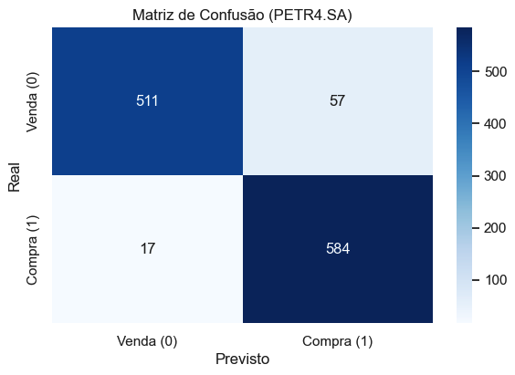
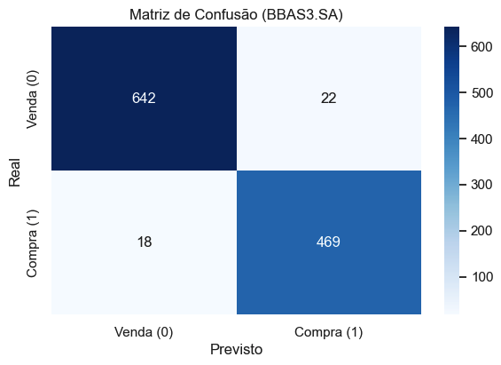
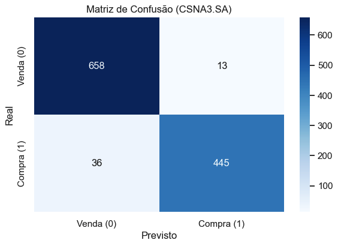
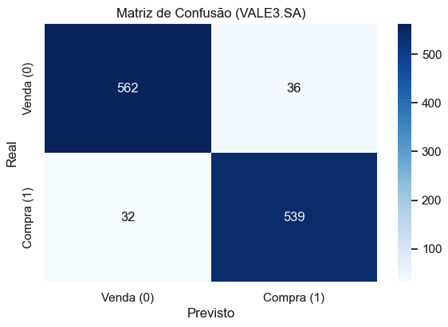

# Análise de Tendências de Ações com Deep Learning

## Introdução

Este projeto implementa modelos de Deep Learning (utilizando TensorFlow/Keras) para análise e previsão de tendências em ações do mercado financeiro brasileiro, como parte de um desafio de Ciência de Dados. O objetivo principal é desenvolver um sistema "perseguidor de tendência" capaz de gerar sinais de compra (+1) ou venda (-1) para 4 ações específicas (VALE3, PETR4, BBAS3 e CSNA3), baseando-se no comportamento dos preços ou indicadores visuais dos últimos 15 dias.

A abordagem segue a proposta do desafio, utilizando dados históricos rotulados por economistas que classificaram cada dia como uma oportunidade de compra ou venda após uma suavização dos preços de fechamento.

## Pré-requisitos

Certifique-se de ter o ambiente configurado corretamente. As principais bibliotecas e versões utilizadas (alinhadas com o ambiente sugerido no desafio) são:

- **Python:** 3.10.9
- **Deep Learning:** TensorFlow >= 2.13, Keras >= 2.13, Keras-Tuner
- **Manipulação e Análise de Dados:** Pandas, NumPy, SciPy, Statsmodels
- **Visualização:** Matplotlib, Seaborn, Plotly
- **Machine Learning:** Scikit-learn
- **Análise Técnica:** TA-Lib, TA (Opcional, dependendo das features exploradas)
- **Processamento de Imagens:** Pillow (Para modelos CNN 2D)
- **Ambiente:** Jupyter, JupyterLab

_(Nota: Uma lista completa está disponível em `requirements.txt`)_

## Estrutura do Projeto

```
├── data/                  # Dados históricos das ações
│   ├── VALE3.SA/          # Dados da Vale
│   ├── PETR4.SA/          # Dados da Petrobras
│   ├── BBAS3.SA/          # Dados do Banco do Brasil
│   └── CSNA3.SA/          # Dados da CSN
├── images/                # Visualizações e gráficos gerados
│   ├── model_performance/ # Gráficos de métricas (Matriz de Confusão, etc.)
│   ├── backtesting/       # Gráficos de resultados do backtesting
│   └── price_vs_predicted_signals/ # Gráficos de preços vs sinais previstos
├── models/                # Modelos treinados salvos
│   ├── BBAS3_SA_cnn_lstm_model.keras   # Modelo CNN-LSTM para BBAS3
│   ├── CSNA3_SA_cnn_lstm_model.keras   # Modelo CNN-LSTM para CSNA3
│   ├── PETR4_SA_cnn_lstm_model.keras   # Modelo CNN-LSTM para PETR4
│   └── VALE3_SA_cnn_lstm_model.keras   # Modelo CNN-LSTM para VALE3
├── notebooks/             # Jupyter notebooks
│   ├── *_eda_notebook.ipynb            # Análise exploratória dos dados
│   ├── *_cnn_lstm_notebook.ipynb       # Implementação de modelos CNN-LSTM
│   ├── vale3_lstm_notebook.ipynb       # Modelo LSTM para Vale
│   ├── vale3_cnn1d_notebook.ipynb      # Modelo CNN 1D para Vale
│   ├── vale3_cnn2d_notebook.ipynb      # Modelo CNN 2D para Vale
│   └── backtest_presentation_notebook.ipynb # Backtesting dos modelos
├── hiper_tuning/          # Scripts para otimização de hiperparâmetros
│   ├── lstm_hyper_tuning.py            # Otimização para modelos LSTM
│   ├── cnn1d_hyper_tuning.py           # Otimização para modelos CNN 1D
│   └── cnn2d_hyper_tuning.py           # Otimização para modelos CNN 2D
├── requirements.txt       # Dependências do projeto
└── README.md              # Este arquivo
```

## Configuração do Ambiente

1.  Clone o repositório:
    ```bash
    git clone https://github.com/felipeneri/deep-learning-stock-prediction
    cd deep-learning-stock-prediction
    ```
2.  Crie um ambiente virtual (recomendado Conda, conforme desafio) e ative-o:
    ```bash
    conda create -n task-stock python=3.10
    conda activate task-stock
    ```
3.  Instale as dependências:
    ```bash
    pip install -r requirements.txt
    # Pode ser necessário instalar o TA-Lib separadamente dependendo do seu sistema operacional.
    # Consulte a documentação do TA-Lib: https://github.com/mrjbq7/ta-lib
    ```

## Modelos Desenvolvidos

Foram explorados diferentes modelos de Deep Learning, conforme sugerido e permitido pelo desafio, focando principalmente em arquiteturas capazes de processar sequências temporais (últimos 15 dias):

- **CNN-LSTM:** Modelo híbrido combinando camadas convolucionais (para extração de padrões locais na sequência) e camadas LSTM (para captura de dependências temporais). Este foi o modelo principal avaliado.
- **(Opcional) CNN 1D:** Utilizando diretamente a sequência de 15 preços como entrada.
- **(Opcional) RNN/LSTM Puro:** Modelos recorrentes puros.
- **(Opcional) CNN 2D:** Utilizando as imagens fornecidas (gráficos de barras normalizados dos últimos 15 dias) como entrada.

Os detalhes da arquitetura, treinamento e otimização de hiperparâmetros para cada modelo podem ser encontrados nos respectivos Jupyter Notebooks na pasta `notebooks/`.

## Avaliação de Desempenho (Conjunto de Teste)

A performance dos modelos foi avaliada no conjunto de teste fornecido (dados de meados de 2019 até Dezembro de 2023), utilizando as métricas obrigatórias solicitadas no desafio.

### PETR4.SA (Modelo CNN-LSTM)

- **Acurácia:** 93.67%
- **AUC Score:** 0.9861
- **Matriz de Confusão:**

- **Relatório de Classificação:**

  ```
              precision    recall  f1-score   support

   Venda (0)       0.97      0.90      0.93       568
  Compra (1)       0.91      0.97      0.94       601

    accuracy                           0.94      1169
   macro avg       0.94      0.94      0.94      1169
  weighted avg     0.94      0.94      0.94      1169
  ```

### BBAS3.SA (Modelo CNN-LSTM)

- **Acurácia:** 96.52%
- **AUC Score:** 0.9958
- **Matriz de Confusão:**

- **Relatório de Classificação:**

  ```
              precision    recall  f1-score   support

   Venda (0)       0.97      0.97      0.97       664
  Compra (1)       0.96      0.96      0.96       487

    accuracy                           0.97      1151
   macro avg       0.96      0.96      0.96      1151
  weighted avg     0.97      0.97      0.97      1151
  ```

### CSNA3.SA (Modelo CNN-LSTM)

- **Acurácia:** 95.75%
- **AUC Score:** 0.9950
- **Matriz de Confusão:**

- **Relatório de Classificação:**

  ```
              precision    recall  f1-score   support

   Venda (0)       0.95      0.98      0.96       671
  Compra (1)       0.97      0.93      0.95       481

    accuracy                           0.96      1152
   macro avg       0.96      0.95      0.96      1152
  weighted avg     0.96      0.96      0.96      1152
  ```

### VALE3.SA (Modelo CNN-LSTM)

- **Acurácia:** 94.18%
- **AUC Score:** 0.9918
- **Matriz de Confusão:**

- **Relatório de Classificação:**

  ```
              precision    recall  f1-score   support

   Venda (0)       0.95      0.94      0.94       598
  Compra (1)       0.94      0.94      0.94       571

    accuracy                           0.94      1169
   macro avg       0.94      0.94      0.94      1169
  weighted avg     0.94      0.94      0.94      1169
  ```

**Gráficos de Sinais Previstos vs. Preço Real:**

Os gráficos abaixo ilustram a aderência entre os sinais (+1 Compra, -1 Venda) previstos pelo modelo CNN-LSTM e o comportamento real dos preços no período de teste.

**PETR4.SA:**

_PETR4.SA - Preço Real vs. Sinais Previstos (Teste: Fev/2019-Jan/2024)._

**BBAS3.SA:**

_BBAS3.SA - Preço Real vs. Sinais Previstos (Teste: Abr/2019-Jan/2024)._

**CSNA3.SA:**

_CSNA3.SA - Preço Real vs. Sinais Previstos (Teste: Abr/2019-Jan/2024)._

**VALE3.SA:**

_VALE3.SA - Preço Real vs. Sinais Previstos (Teste: Fev/2019-Jan/2024)._

## Backtesting da Estratégia (Avaliação Financeira Opcional)

Como exploração adicional (opcional conforme o desafio), realizamos um backtesting para simular o desempenho financeiro de uma estratégia de trading simples baseada nos sinais do modelo CNN-LSTM.

- **Período:** Janeiro de 2024 a Maio de 2024.
- **Fonte de Dados:** Cotações diárias obtidas via `yfinance`.
- **Modelo:** CNN-LSTM treinado.
- **Estratégia:**
  - Comprar na abertura do dia seguinte se Prob(Preço Subir) > `BUY_THRESHOLD` (ex: 0.70) e não houver posição.
  - Vender na abertura do dia seguinte se Prob(Preço Subir) < `SELL_THRESHOLD` (ex: 0.40) e houver posição comprada.
  - Manter posição caso contrário.
- **Simplificações:** Não considera custos de transação, slippage, impacto no preço ou dividendos (além do preço ajustado).
- **Comparação:** Desempenho da estratégia vs. Buy & Hold (comprar no início e vender no final).

**Resultados Visuais do Backtesting:**

Os gráficos comparam o retorno acumulado da estratégia (azul/roxo) com o Buy & Hold (laranja) para um capital inicial de R$ 10.000. Marcadores indicam pontos de compra (`^`) e venda (`v`).

_(Nota: Os limiares (0.7/0.4) foram aplicados uniformemente. Otimização por ativo poderia gerar resultados diferentes.)_

**PETR4.SA:**

_Resultado (Jan/24-Mai/Abr/2025): Estratégia +19.29% vs Buy & Hold +8.91%._

**BBAS3.SA:**

_Resultado (Jan/24-Mai/Abr/2025): Estratégia +12.39% vs Buy & Hold +18.44%._

**CSNA3.SA:**

_Resultado (Jan/24-Mai/Abr/2025): Estratégia -2.36% vs Buy & Hold -34.11%._

**VALE3.SA:**

_Resultado (Jan/24-Mai/Abr/2025): Estratégia -3.71% vs Buy & Hold -15.58%._

_Análises mais detalhadas do backtesting, incluindo métricas como Sharpe Ratio e Volatilidade, estão no notebook `05_Backtesting_Evaluation.ipynb`._

## Conclusão

Este projeto desenvolveu e avaliou modelos de Deep Learning (principalmente CNN-LSTM) para prever tendências de compra/venda em 4 ações brasileiras, utilizando dados dos últimos 15 dias, conforme proposto no desafio.

Os modelos apresentaram alta performance no conjunto de teste, com acurácias variando entre 93.67% (PETR4) e 96.52% (BBAS3), e AUC Scores consistentemente acima de 0.98, indicando boa capacidade de discriminação entre as classes de Compra e Venda.

O backtesting opcional em período posterior aos dados de teste (Jan 2024 - Abr 2025) indicou que a estratégia baseada no modelo CNN-LSTM superou o Buy & Hold para PETR4, CSNA3 e VALE3, mas ficou abaixo para BBAS3, utilizando limiares fixos. Isso sugere potencial, mas reforça a necessidade de otimização por ativo e a cautela com resultados passados.

**Limitações e Próximos Passos:**

- A performance pode variar com diferentes arquiteturas, features e otimizações.
- O backtesting é simplificado e não reflete custos reais de operação.
- Explorar features adicionais (sentimento de notícias, dados macroeconômicos).
- Implementar estratégias de gerenciamento de risco mais robustas.

Os Jupyter Notebooks fornecem todos os detalhes da implementação, treinamento e análise.
